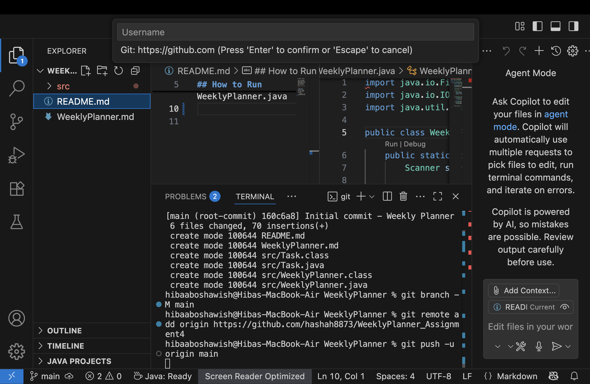

# Weekly Planner App

A simple **Java console application** that allows the user to plan their weekly tasks. Users can choose **3–7 tasks** per week, assign each task to a day, and save them into a **Markdown file (`WeeklyPlanner.md`)** for easy reference.

---

## Features

- Enter 3–7 tasks for the week.
- Assign each task to a specific day (Monday to Sunday).
- Saves all tasks into a Markdown file.
- Simple and user-friendly terminal interface.

---

## How to Run

1. Open a terminal in the project folder.
2. Compile the Java files:
   ```bash
   javac -d . src/Task.java src/WeeklyPlanner.java Main.java
3. 

